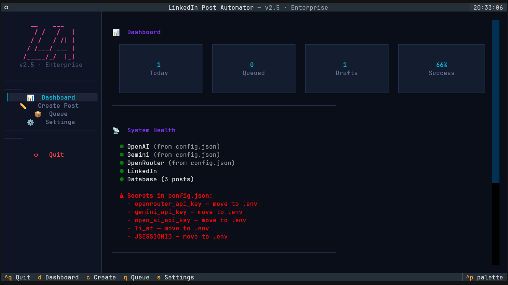
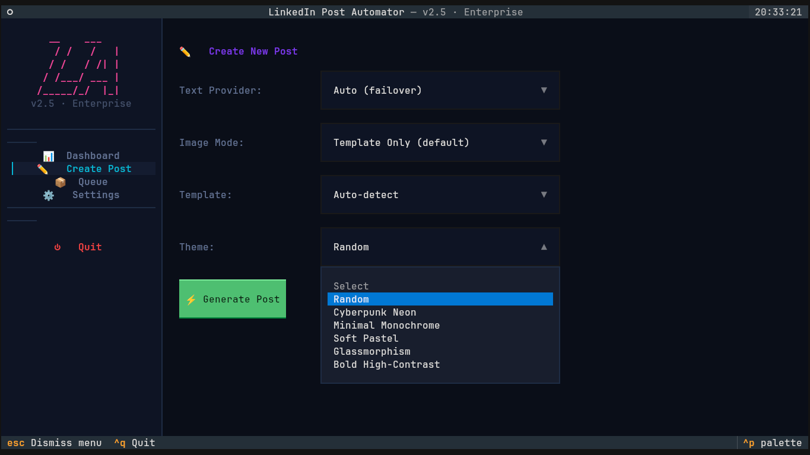
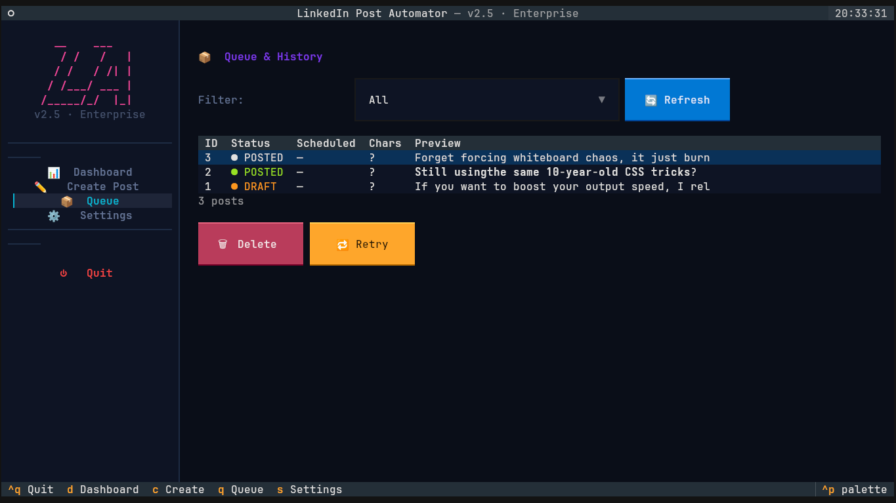
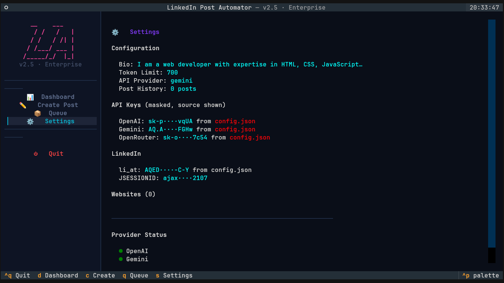

<div align="center">


# 🚀 LinkedIn Post Automator
### *Enterprise Edition · v2.5*

**A fully automated, terminal-based GUI (TUI) for generating, designing, and scheduling high-quality LinkedIn posts — right from your command line.**

<br/>


<br/>



</div>

---

## 📑 Table of Contents

- [✨ Features](#-features)
- [🖼️ Preview](#️-preview)
- [🛠️ Beginner's Setup Guide (Linux)](#️-beginners-setup-guide-linux)
  - [Step 1 — Install Python & Git](#step-1--install-python--git)
  - [Step 2 — Clone the Repository](#step-2--clone-the-repository)
  - [Step 3 — Set Up a Virtual Environment](#step-3--set-up-a-virtual-environment)
  - [Step 4 — Install Dependencies](#step-4--install-dependencies)
  - [Step 5 — Configuration (.env)](#step-5--configuration-setup-secured-via-env)
  - [Step 6 — Run the App 🎉](#step-6--run-the-app-)
- [💡 Troubleshooting](#-troubleshooting)
- [🗺️ Roadmap](#️-roadmap)
- [🤝 Contributing](#-contributing)
- [📄 License](#-license)

---

## ✨ Features

<table>
<tr>
<td width="50%">

### 🎨 Beautiful Terminal UI
Built with **Textual**, featuring a fully interactive dashboard and clean, compact ASCII aesthetics — no browser required.

### 🧠 Dynamic Content Engine
Advanced AI prompting tuned to avoid generic, robotic-sounding posts. Every output reads like it was actually written by a human.

### 🖌️ Premium Infographics *(v2.5)*
A deterministic visual engine powered by **PIL** and **NumPy**. Ships with **7 robust templates** (Quote Cards, Step Flows, Code Snippets, and more) and **5 gorgeous color themes** featuring frosted glassmorphism.

</td>
<td width="50%">

### 🗄️ Rock-Solid Database Layer
**SQLite**-backed background queueing with thread-safe **WAL mode** and automatic draft saving — nothing gets lost.

### 🔐 Config Hardening
Secrets are never hardcoded. Everything sensitive lives safely in a local `.env` file.

### 🔁 Multi-Model Failover
Automatic failover across **OpenRouter, Gemini, OpenAI, and Pollinations** — if one provider goes down, the app keeps going.

</td>
</tr>
</table>

---

## 🖼️ Preview

<div align="center">

### Dashboard


### Create Post


### Queue Manager


### Settings & Config


</div>

---

## 🛠️ Beginner's Setup Guide (Linux)

Follow these steps from start to finish to get the app running on your machine. No prior experience needed — just copy, paste, and go.

### Step 1 — Install Python & Git

Before you can run the app, you need Python and Git installed on your system. Open your terminal and run the command for your specific distribution:

<details open>
<summary><b>🐧 Ubuntu / Debian / Pop!_OS / Mint</b></summary>

```bash
sudo apt update
sudo apt install python3 python3-pip python3-venv git -y
```
</details>

<details>
<summary><b>🐧 Arch Linux / Manjaro / EndeavourOS</b></summary>

```bash
sudo pacman -Syu python python-pip git
```
</details>

<details>
<summary><b>🐧 Fedora</b></summary>

```bash
sudo dnf install python3 python3-pip git
```
</details>

---

### Step 2 — Clone the Repository

Download the project to your computer using Git:

```bash
# Clone the repository
git clone https://github.com/Ubaidullah-Web-Dev/LinkedIn-Post-Generator.git

# Navigate into the project folder
cd LinkedIn-Post-Generator
```

---

### Step 3 — Set Up a Virtual Environment

It's a Python best practice to install dependencies in an isolated "virtual environment" so they don't conflict with your system packages.

```bash
# Create a virtual environment named "venv"
python3 -m venv venv

# Activate the virtual environment
source venv/bin/activate
```

> ⚠️ **Remember:** You must run `source venv/bin/activate` every time you open a new terminal to run the app.

---

### Step 4 — Install Dependencies

Now, install all the required Python libraries for the app to function — including `textual` for the UI, `Pillow` and `NumPy` for the graphics engine, and `python-dotenv` for secrets management.

```bash
pip install -r requirements.txt
```

---

### Step 5 — Configuration Setup (Secured via `.env`)

The app needs your API keys and LinkedIn session cookies to work. A `.env` file is used to keep all of this secure and out of version control.

**1.** Create a `.env` file in the root of the project:

```bash
touch .env
```

**2.** Open `.env` in a text editor (e.g. `nano .env` or VS Code).

**3.** Fill in your credentials:

```env
# Required for posting
LI_AT=your_linkedin_li_at_cookie
JSESSIONID=your_linkedin_jsessionid_cookie

# Required for AI text generation (pick at least one)
OPENROUTER_API_KEY=your_openrouter_key
GEMINI_API_KEY=your_gemini_key
OPENAI_API_KEY=your_openai_key
```

<details>
<summary>🍪 <b>How to get your LinkedIn cookies</b></summary>
<br/>

1. Go to LinkedIn in your browser and log in.
2. Open Developer Tools (`F12`) → **Application** tab → **Cookies** → `www.linkedin.com`.
3. Copy the values for `li_at` and `JSESSIONID` into your `.env` file.

</details>

> 💡 **Optional:** Copy `example_config.json` to `config.json` to configure non-secret settings like your bio, websites, and default token limits.

---

### Step 6 — Run the App! 🎉

Once everything is configured, simply run the main script to launch the beautiful terminal GUI:

```bash
python main.py
```

---

## 💡 Troubleshooting

| Problem | Solution |
|---|---|
| **`python: command not found`** | Try running `python3 main.py` instead. Some distros only alias `python3`. |
| **Images looking weird?** | By default, the app uses the deterministic Infographic engine (`template_only`). Selecting `ai_only` or `hybrid` may produce unpredictable AI-generated visuals — stick to the built-in templates for consistently professional results. |

---

## 🗺️ Roadmap

- [ ] Screenshots & demo GIF
- [ ] Additional infographic templates
- [ ] Windows / macOS setup guide
- [ ] Docker support

---

## 🤝 Contributing

Contributions, issues, and feature requests are welcome! Feel free to check the [issues page](https://github.com/Ubaidullah-Web-Dev/LinkedIn-Post-Generator/issues) if you'd like to help out.

---

## 📄 License

This project is licensed under the **MIT License** — feel free to use, modify, and distribute it.

<div align="center">

<br/>

**Made with ❤️ and a lot of ☕ by [Ubaidullah-Web-Dev](https://github.com/Ubaidullah-Web-Dev)**

⭐ *If you find this project useful, consider giving it a star!*

</div>